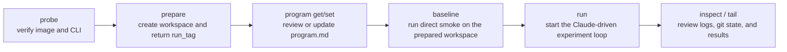

# autoresearch-modal

`autoresearch-modal` is an adaptation of [`karpathy/autoresearch`](https://github.com/karpathy/autoresearch) with a [`Modal`](https://modal.com) runtime for running autonomous training experiments on NVIDIA GPUs.

This repository keeps the upstream research files at the repo root and adds the
project-specific pieces needed to operate that workflow on Modal:

- a dedicated developer CLI: `autoresearch-modal`
- persistent workspace and cache volumes keyed by `run_tag`
- repo-owned inspection and log surfaces
- repo-local architecture, product, and operator documentation

It is intentionally narrow in scope. This repo is not a general-purpose agent
sandbox or a web product.

## What This Repo Owns

The upstream training contract still matters:

- `prepare.py` handles fixed data prep, tokenizer creation, and evaluation
  helpers
- `train.py` is the file the autonomous loop edits
- `program.md` is the human-controlled control plane for the research run

`autoresearch-modal` adds the wrapper around that contract:

- `cli/` exposes the public command surface
- `agent_sandbox/autoresearch_app.py` defines the Modal entrypoint and runtime
  orchestration
- `agent_sandbox/config/settings.py` holds typed runtime settings and secret
  wiring
- `docs/` carries the product spec, architecture notes, runbook, and execution
  plans

## Runtime Model

Each experiment series lives in a persistent workspace identified by a
`run_tag`.

- `prepare`, `baseline`, and `run` can create a fresh sortable `run_tag` when
  you omit `--run-tag`
- `program get`, `program set`, `inspect`, `tail`, and `claude-baseline`
  require an explicit existing `run_tag`
- experiment branches inside the seeded workspace follow
  `autoresearch/<run_tag>` from upstream `master`
- the human edits `program.md`; the agent loop edits `train.py`

Each run workspace is seeded from an explicit vendored-root allowlist so the
workspace repo stays upstream-shaped instead of copying wrapper-owned files.

Seeded repo root entries:

- `.gitignore`
- `.python-version`
- `README.md`
- `analysis.ipynb`
- `prepare.py`
- `program.md`
- `progress.png`
- `pyproject.toml`
- `train.py`
- `uv.lock`

Wrapper-owned surfaces such as `AGENTS.md`, `ARCHITECTURE.md`, `agent_sandbox/`,
`docs/`, `scripts/`, and `tests/` stay in the source repo and are not copied
into the per-run workspace repo.

## Requirements

- Python 3.11
- [`uv`](https://docs.astral.sh/uv/)
- Modal configured locally
- a Modal GPU target for live runs (default runtime is H100)
- an Anthropic secret in Modal for Claude-driven commands

The direct `baseline` path does not require Anthropic credentials.

## Setup

```bash
uv sync --group dev --python 3.11
source .venv/bin/activate
modal setup
modal secret create anthropic-secret ANTHROPIC_API_KEY=your_key_here
```

The commands below assume you have already activated the repo virtualenv with
`source .venv/bin/activate`.

## Quick Start

The correct public CLI order is:



1. Probe the CLI and runtime image before creating any run state:

```bash
autoresearch-modal probe
```

2. Prepare a fresh workspace and warm the cache:

```bash
autoresearch-modal prepare --num-shards 10
```

That command returns the actual `run_tag`. Save it and use that same tag for
the rest of the workflow.

3. Inspect or update the run-specific `program.md`:

```bash
autoresearch-modal program get --run-tag <run_tag>
autoresearch-modal program set --run-tag <run_tag> --file ./program.md
```

4. Run one direct baseline smoke on that prepared workspace:

```bash
autoresearch-modal baseline --run-tag <run_tag>
```

5. Run the primary Claude-driven experiment loop on the same `run_tag`:

```bash
autoresearch-modal run --run-tag <run_tag> --max-experiments 12 --max-turns 200
```

6. Inspect logs, git state, and results:

```bash
autoresearch-modal inspect --run-tag <run_tag> --lines 30
autoresearch-modal tail --run-tag <run_tag> --artifact agent --lines 80
```

The `run` command is also available through the `agent-loop` alias.

For GitHub users, this `probe -> prepare -> program -> baseline -> run ->
inspect/tail` sequence is the canonical CLI flow. `inspect`, `tail`,
`program get`, and `program set` require an existing `run_tag`. While
`prepare`, `baseline`, and `run` can generate a fresh tag automatically, the
recommended public workflow is to start with `prepare` and keep using the
returned tag so one workspace is carried through end to end.

## Dry Run Support

Append `--dry-run` before or after any subcommand to preview the resolved Modal
target, subprocess argv, scalar kwargs, and compact metadata for file-backed
inputs without contacting Modal.

```bash
autoresearch-modal --dry-run prepare --num-shards 10
autoresearch-modal program set --dry-run --run-tag smoke --file ./program.md
```

## Developer Docs

Start here when working inside the repo:

- `AGENTS.md`
- `ARCHITECTURE.md`
- `docs/product-specs/autoresearch-modal.md`
- `docs/references/autoresearch-modal-runbook.md`

Those documents are the source of truth for repo scope, runtime behavior, and
operator commands.

## Validation

```bash
ruff check --fix .
ruff format .
pytest
autoresearch-modal probe
```

## Provenance

The root research files are vendored from
[`karpathy/autoresearch`](https://github.com/karpathy/autoresearch), but this
README intentionally documents only the `autoresearch-modal` wrapper, workflow,
and operating contract.
